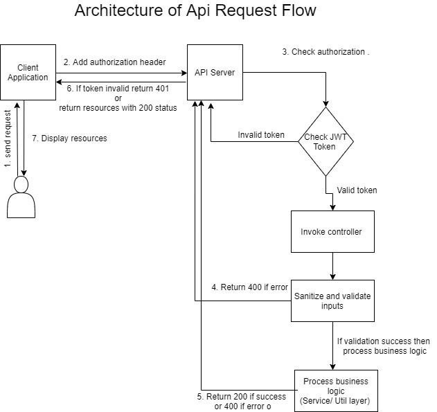
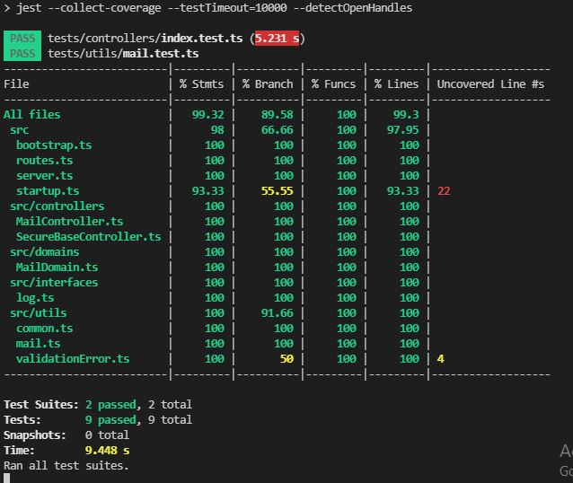
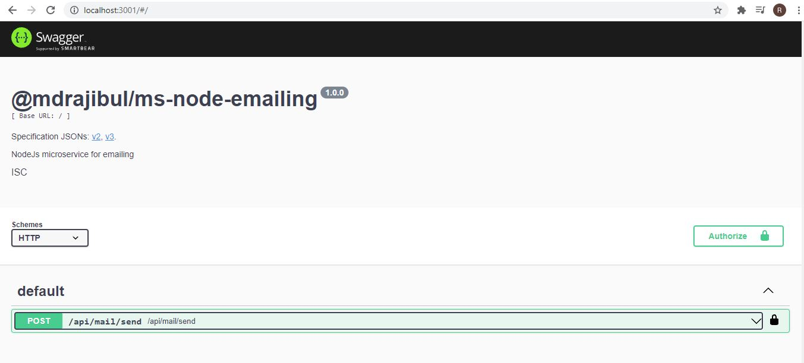

# NodeJs microservice for mailing

## **Getting Started** 
- Clone <https://github.com/mdrajibul/ms-node-emailing.git>
- Checkout branch **master** (if not default)
- Run `npm install`
- Run `npm start`
- Browse http://localhost:3001/ and test api

## **Folder Structure**
- **src:** directory is for the source code of the module. Production build will compile from here.
- **setup:** directory is for configuration. Profile-based configuration you can do here. The file format is yml, so anyone can update easily. For every environment, there should have a separate yml file. File format should be profile.**PROFILE\_ENV**.yml. For example, the production environment file name should be profile.prod.yml. While start or build the project you should pass --profile=prod under the scripts section in package.json file. By default its --profile=dev. Also, you can change profilePath as --profilePath=YOUR-PATH. For details visit <https://github.com/mdrajibul/cloud-config-utils>
- **tests:** directory is for all test files. Filename should be \*.test.ts
- **src/controllers:** directory is for controller file. To secure the endpoint we should extend SecureBaseController. `authFilter` method is responsible to authorize endpoint base on requirements.
- **src/domains:** directory for domain files. Its Domain-driven design concepts of sanitizing, validate inputs and might be processed business logic for one entity.
- **src/utils:** directory for utility files. 
- **src/utils/logs:** directory for logging library. A custom-made logging library. It supports appender concept. We can add more customer appender and register them through profile.ENV.yml file

## **Architecture overview**
- `server.ts` file is the main entry file exported in index.ts file. `server.ts` file is responsible to start the Node server by using startup.ts file
- `routes.ts` file is responsible to route the endpoints by initializing a particular controller class
- Base on endpoint request, a particular controller's function will call and send the response
- Before invoke the controller function, it will call `authFilter` to check authorization.
- Once a particular controller function call the first duty is to sanitize and validate through a particular domain class. If it is validated then call service or utils function to process business logic
- Finally after process business logic, the response will send out with proper http code and message
- All error and success result logged in both console and file (base on configuration)
- See the api architecture flow

### **Testing** 

#### **Unit and Integration test**
This is project is the coverage almost 100% of test coverages. 
- To run test cases use the below command
  - `npm run test`
- See the below code coverage
- 

#### **Manual api testing**  
 - Browse http://localhost:3001/
 - A swagger api testing page will be visible to test apis
 - I made the api authorized with fixed jwt token. Please visit particular profile.ENV.yml(profile.dev.yml) file and copy `jwtToken` token
 - Paste `jwtToken` into authorization header by pressing `Authorize` button.
 - Now go particular api (`/api/mail/send`) link to test api.
 - Click `Try it out` button and give proper data to test.
 - Also you can give invalid data to test teh validation or error 
 - To setup email please check `profile.dev.yml` or `profile.prod.yml` file
 - Manually email testing from localhost, please visit https://github.com/ChangemakerStudios/Papercut-SMTP/releases, downlaod and install.
 - Click the below video link and watch for demo
  [](./assets/images/demo.mp4)


### **Production**
For high availability, we can use `load balancer` from any cloud platform.

#### **Manual deployment** 
To make a production build please follow below guideline

- Run `npm run build` to produce production build 
- All production files should be store in `dist` folder
- Use any ci/cd tools or manual to build and deploy your project

#### **Using docker**
 This project dockerised. To run the project in container you have to follow below steps
 - cmd to /project/ms-node-emailing. As I set WORKDIR to /project/ms-node-emailing. If you want to change then please do.
 - upload all project files into /project/ms-node-emailing or if you upload in git then clone that directory
 - After done run below command
    - docker build -t ms-node-emailing .
    - docker run -p 8001:8001 -d --name=docker-ms-node-emailing ms-node-emailing
 - Finally, browse http://HOST:8001 and test your API

## **Future enhancement**
- Instead of fix JWT token, we can intgerate oauth2 protocol
- Enrich mail functionalities
- Enrich logging library


## For developer/QA engineer
Below are the useful command to run and test the application

#### Run

```base
npm install
npm start
```
#### Build

```base
npm run build
```
#### Test

```base
npm run test
npm run test:prod
```
#### Code Fixing

```base
npm run prettier
npm run lint
```